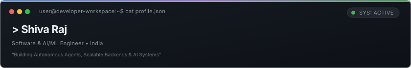
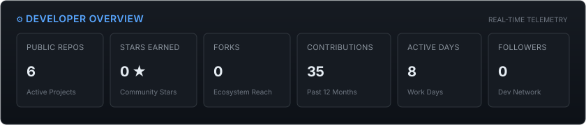
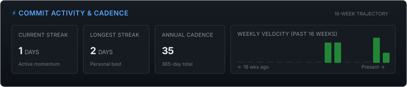
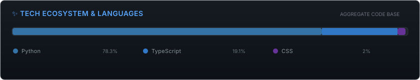
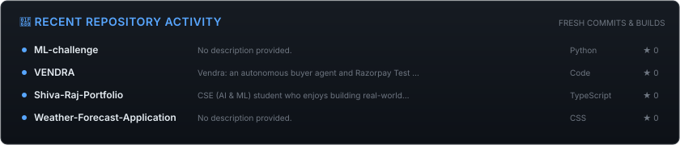

  

  <strong>CSE (AI & ML) Student &bull; Software & Systems Engineer &bull; Builder</strong>

---

### ⚡ Overview

I'm **Shiva Raj**, a computer science student specializing in Artificial Intelligence and Machine Learning. I focus on engineering autonomous agents, high-reliability backend systems, and applied AI applications. I believe in learning by constructing production-ready software from first principles.

---

### 🎯 Current Focus & Trajectory

<!-- STATUS:START -->
- 🔭 **Currently engineering:** [**VENDRA**](https://github.com/shivaraj4791/VENDRA) — Autonomous buyer agent with real-time merchant workflows
- 🧠 **Deepening knowledge in:** Autonomous Multi-Agent Architectures & High-Performance Backends
- 💬 **Open for collaboration on:** Open-Source AI & Developer Tooling
<!-- STATUS:END -->

---

### 🛠️ Technical Arsenal

<samp>
<b>Languages:</b> Python &bull; JavaScript &bull; TypeScript &bull; C &bull; C++ &bull; Java &bull; SQL 
<b>AI & Machine Learning:</b> PyTorch &bull; Scikit-Learn &bull; OpenCV &bull; LangChain &bull; Autonomous Agents 
<b>Backend & Systems:</b> Node.js &bull; FastAPI &bull; Express &bull; RESTful APIs &bull; Linux &bull; Git 
<b>DevOps & Workflows:</b> GitHub Actions &bull; Docker &bull; VS Code &bull; CI/CD Pipelines
</samp>

---

### 📊 Real-Time GitHub Telemetry

> Real-time developer metrics generated directly from GitHub GraphQL & REST APIs via local deterministic SVG engines.

<!-- STATS:START -->

  

  

  

  

<!-- STATS:END -->

---

### 🔥 Featured Projects

<!-- FEATURED_REPOS:START -->
| Project | Description | Stack | Stats |
| :--- | :--- | :--- | :---: |
| [**VENDRA**](https://github.com/shivaraj4791/VENDRA) | Vendra: an autonomous buyer agent and Razorpay Test Mode merchant demo. | `Multi-stack` | &#9733; 0 &bull; &#9903; 0 |
| [**Shiva-Raj-Portfolio**](https://github.com/shivaraj4791/Shiva-Raj-Portfolio) | CSE (AI & ML) student who enjoys building real-world projects and learning by doing. I work with Python, Java & C, and I’m exploring AI/ML, backend development, and DSA. Currently looking for opportunities to learn, contribute, and grow as a software/AI engineer. 🚀 | `TypeScript` | &#9733; 0 &bull; &#9903; 0 |
| [**ML-challenge**](https://github.com/shivaraj4791/ML-challenge) | Project repository and source code. | `Python` | &#9733; 0 &bull; &#9903; 0 |
| [**Weather-Forecast-Application**](https://github.com/shivaraj4791/Weather-Forecast-Application) | Project repository and source code. | `CSS` | &#9733; 0 &bull; &#9903; 0 |
<!-- FEATURED_REPOS:END -->

---

### 🌐 Connect & Collaborate

- 💼 **Portfolio:** [shivaraj4791.github.io/Shiva-Raj-Portfolio](https://shivaraj4791.github.io/Shiva-Raj-Portfolio)
- 🐙 **GitHub:** [@shivaraj4791](https://github.com/shivaraj4791)
- ✉️ **Email:** [shivaraj4791@gmail.com](mailto:shivaraj4791@gmail.com)

---

<!-- AUTO-GENERATED:START -->

  ⚡ <em>This profile and its telemetry cards are dynamically generated via GitHub Actions workflows and local deterministic SVG engines. Zero third-party image hosts.</em>

<!-- AUTO-GENERATED:END -->
