[portfolio](https://shivaraj4791.github.io/Shiva-Raj-Portfolio) &nbsp;·&nbsp;
[github](https://github.com/shivaraj4791) &nbsp;·&nbsp;
[linkedin](https://www.linkedin.com/in/shivaraj4791) &nbsp;·&nbsp;
[email](mailto:shivaraj4791@gmail.com)

> CSE (AI & ML) student who loves building real-world projects and learning by doing. 
> Small, sharp tools over big vague ideas.

I focus on building autonomous multi-agent systems, backend engineering, and applied machine learning. 
Right now that's [VENDRA](https://github.com/shivaraj4791/VENDRA) — an autonomous buyer agent with Razorpay integration. 
Also exploring multi-agent architectures, distributed systems, and real-time developer tooling.

<samp>python &nbsp; typescript &nbsp; javascript &nbsp; c &nbsp; c++ &nbsp; java &nbsp; fastapi &nbsp; node &nbsp; pytorch &nbsp; docker &nbsp; git &nbsp; linux</samp>

<!-- FEATURED_REPOS:START -->
**[VENDRA](https://github.com/shivaraj4791/VENDRA)** &nbsp;·&nbsp; <samp>code</samp> 
Vendra: an autonomous buyer agent and Razorpay Test Mode merchant demo.

**[Shiva-Raj-Portfolio](https://github.com/shivaraj4791/Shiva-Raj-Portfolio)** &nbsp;·&nbsp; <samp>typescript</samp> 
CSE (AI & ML) student who enjoys building real-world projects and learning by doing. I work with Python, Java & C, and I’m exploring AI/ML, backend development, and DSA. Currently looking for opportunities to learn, contribute, and grow as a software/AI engineer. 🚀

**[ML-challenge](https://github.com/shivaraj4791/ML-challenge)** &nbsp;·&nbsp; <samp>python</samp> 
Project repository and source code.

**[Weather-Forecast-Application](https://github.com/shivaraj4791/Weather-Forecast-Application)** &nbsp;·&nbsp; <samp>css</samp> 
Project repository and source code.
<!-- FEATURED_REPOS:END -->

<!-- AUTO-GENERATED:START -->
> Generated automatically by a daily GitHub Actions workflow with zero external dependencies. 
> All telemetry cards and the ASCII portrait are rendered locally as deterministic SVGs.
<!-- AUTO-GENERATED:END -->
